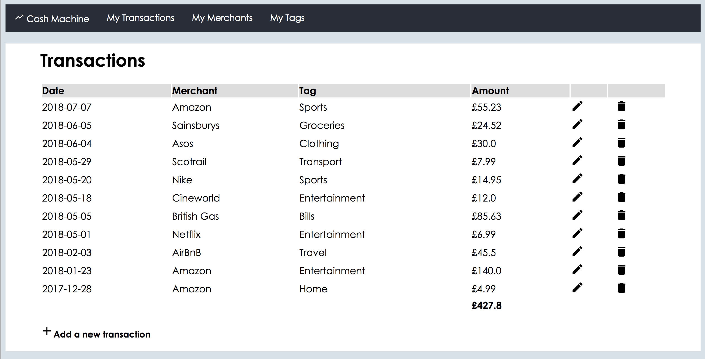

# Ruby Spending Tracker Project

## Synopsis
This web application allows users to track their financial transactions. Users are able to add a transaction with a date, merchant, tag, and amount to a database. There are also features to break down transactions by an indiviual merchant or tag.

## Motivation
The application was built during my time at CodeClan as one of three web application projects.

## Built With
* Ruby
* Sinatra (web framework)
* HTML/CSS
* postgreSQL (database management)

## Screenshot of the home page

